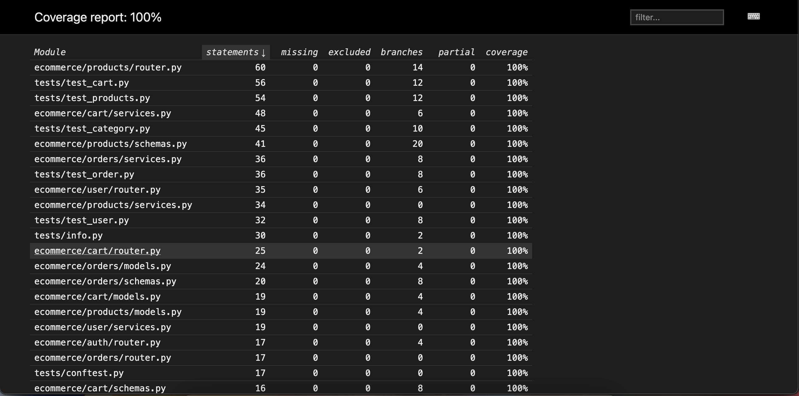

## Python Dependencies

- Installing Python Packages

```bash

$ pip install -r requirements.txt

```


- Running Uvicorn Server

```bash

$ uvicorn main:app --reload

```

## Testing

Before proceeding make sure you have created a test database in Postgres.


## Coverage

Coverage Report


